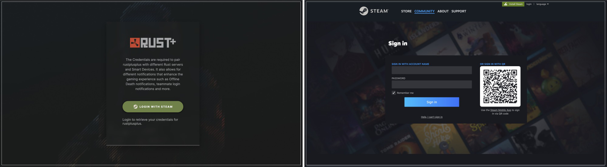
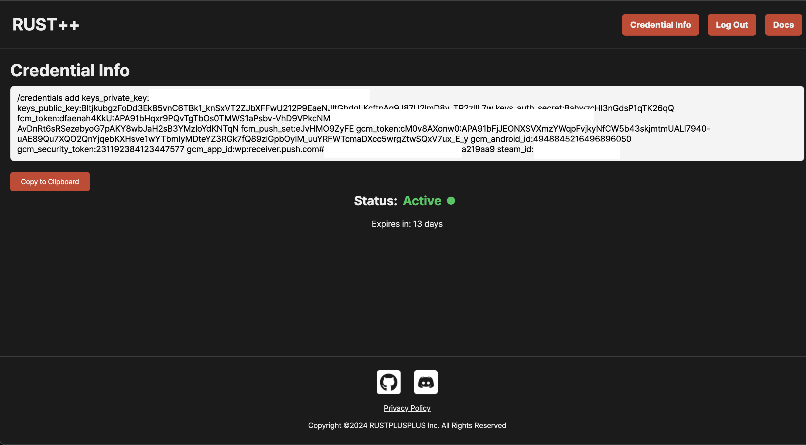
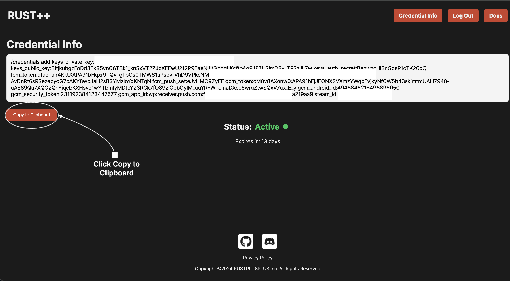
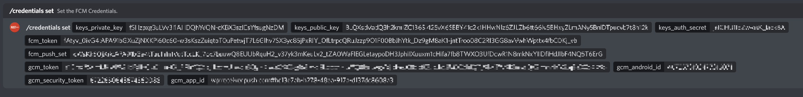

# Документация по Учетным Данных (Веб-Версия)

> Чтобы правильно использовать экземпляр бота, вам необходимо настроить ваши учетные данные. Добавление этих учетных данных позволяет вам связываться с серверами, а также подключаться к ним. Обратите внимание, что в отличие от предыдущей версии .exe, веб-версия требует браузеров Chrome или Firefox.

## **❗️Перед началом**
> Убедитесь, что вы используете **`браузеры Chrome или Firefox`** перед началом процесса настройки учетных данных.
> Это связано с тем, что веб-версия использует расширения браузера для упрощения процесса, что более легковесно и удобно по сравнению с относительно тяжёлым приложением .exe.

## Получение Учетных Данных

1. **Сначала перейдите на [страницу rustplusplus-credentials](https://rustplusplus-credentials.netlify.app/).**

2. **Нажмите кнопку Установить Расширение, расположенную в правом верхнем углу страницы, чтобы установить расширение, затем обновите страницу. (После установки кнопка Войти должна быть видна)**

> [rustPlusPlus-Credentials Расширение для Chrome](https://chromewebstore.google.com/detail/rustplusplus-credential-a/ooahmkklkanfgfmphpknpcgdpdcoikhe)

> [rustPlusPlus-Credentials Расширение для Firefox](https://addons.mozilla.org/en-US/firefox/addon/rustplusplus-credential-app)

   

   

3. **Нажмите кнопку Войти, чтобы продолжить вход в Steam.**

   

4. **После входа вы будете перенаправлены на страницу отображения, где будет показана команда слэш `/credentials add ....`**

   

5. **Нажмите `Скопировать`, чтобы скопировать команду слэш.**

   

6. **Вставьте команду слэш в текстовый канал вашего сервера Discord. Конкретный текстовый канал не важен, главное, чтобы бот имел к нему доступ.**

   

7. **Этот процесс одинаков для владельца бота и для любого члена команды, который хочет зарегистрировать свои учетные данные (в основном для расширения использования команды лидера). После того как член команды зарегистрировал свои учетные данные, ему необходимо зайти в игру и связаться с сервером. Члены команды, связанные с сервером, могут быть видны в информационном канале, обозначенные значком P рядом с их именем, как показано ниже:**

   

## Почему необходимы учетные данные?

Учетные данные необходимы для активации следующих функций:

* Уведомления о связи с сервером
* Уведомления о связи с умными устройствами
* Уведомления о умных будильниках
* Уведомления о смерти игрока в оффлайне
* Уведомления о входе товарища по команде
* Новости Facepunch

Без них бот не будет работать должным образом.

> **Примечание**: Этот процесс требует браузеров Chrome или Firefox для веб-версии. Убедитесь, что ваш браузер обновлён для наилучшего опыта.

> API Rust Companion возвращает обновлённый токен аутентификации Steam, который истекает через 2 недели. Вы можете в любой момент посетить [страницу отображения rustplusplus-credentials](https://rustplusplus-credentials.netlify.app/display), чтобы проверить, сколько времени осталось на вашем токене.
