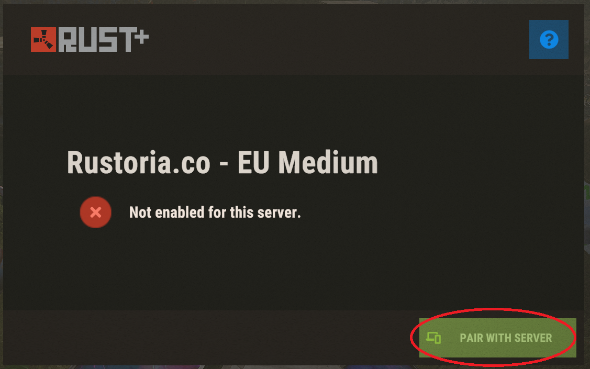
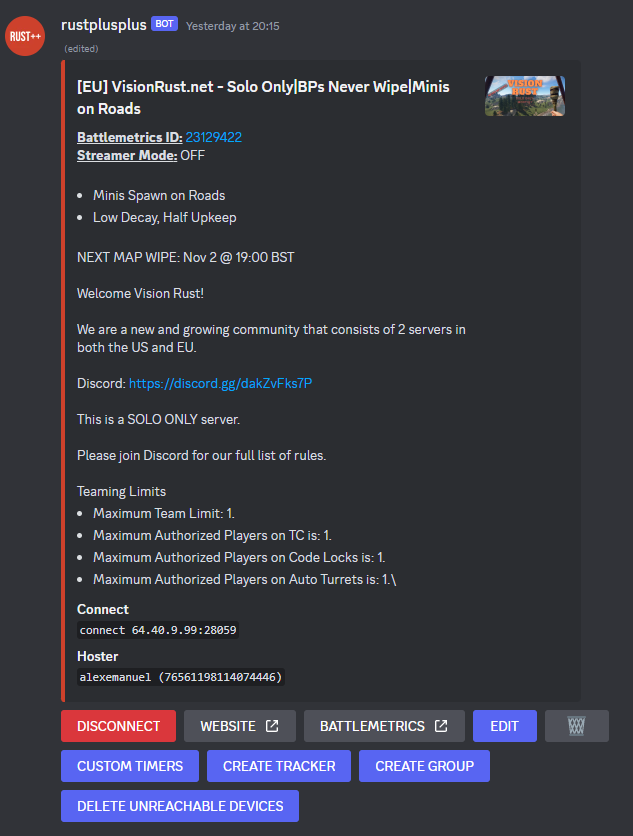

# Подключение к серверу

1. Убедитесь, что вы настроили учетные данные и что бот в данный момент работает (`npm start run`).
2. Войдите на сервер Rust, на котором хотите играть.
3. Нажмите `ESC`, а затем выберите `Rust+`.
4. Нажмите `ПАРА С СЕРВЕРОМ`.

5. После того как вы подключите сервер, он должен появиться в текстовом канале Discord `servers`.

6. Оттуда просто нажмите кнопку `ПОДКЛЮЧИТЬ`, и бот подключится к серверу Rust.
